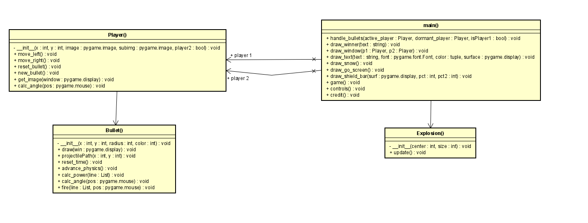

# Team Orange
# Team members
1. Ryan Choy 014499316
2. William Su 013697658
3. Janaarthana Harri 015246205
4. Premchand

# Contributions
1. Ryan
2. William
3. Janaarthana
4. Premchand

# Summary
The idea for this game project is a multiplayer shooting game where a player has to use the mouse to shoot a projectile. The projectile's movement speed and direction depends on the location of the mouse, the further away the mouse is from the player, the faster it will go. Players have a set amount of distance they can travel in a turn and uses the a and d key on the keyboard to move left and right respectively. Players would take turns shooting the projectile and when their respective hp goes down to 0, the opponent will win the game. The game will then restart after a few moments.

# Architectural diagram
Class Diagram:

Sequence Diagram:

# Key Features
1. Speed and angle of projectile based on location of mouse
2. Different character models
3. Dynamic hp bar visual that changes based on incoming damage
4. Dynamic pixel elements imitating snow fall
5. Characters model change its direction based on the position of the mouse

# Youtube Ad link

# Game demo link

# Team Kanban Board

