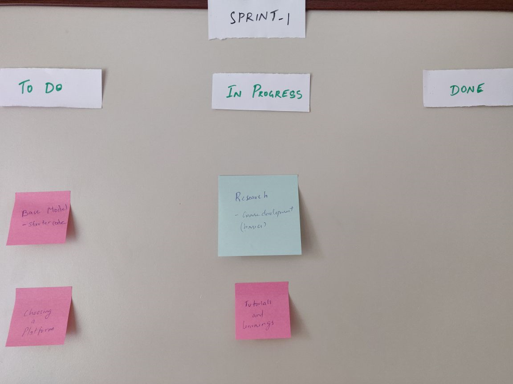
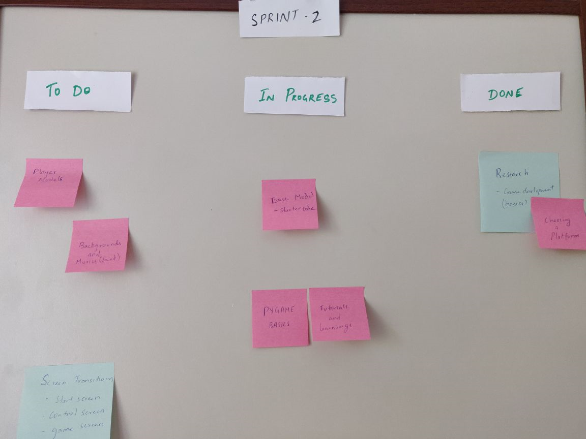
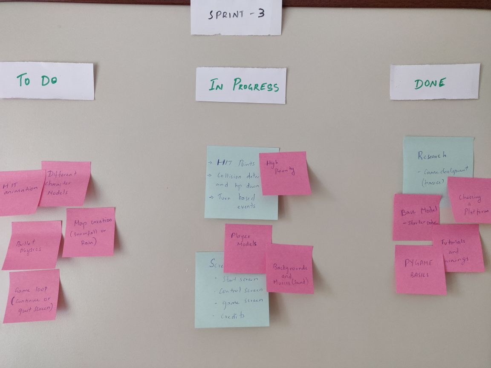
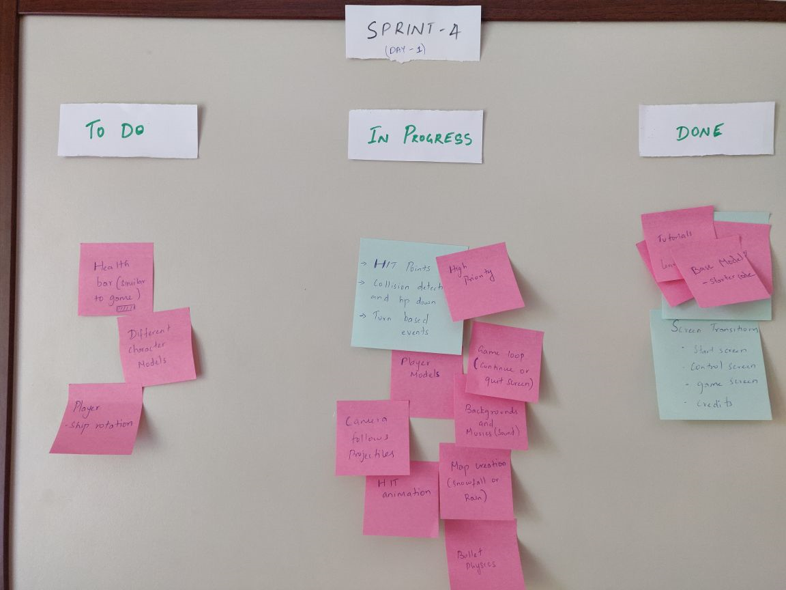
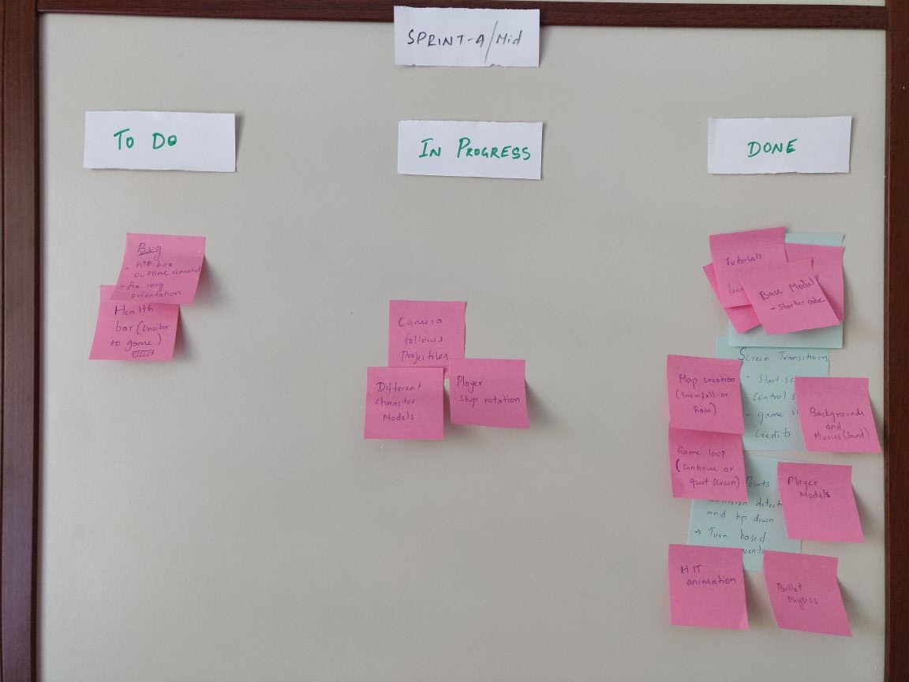

# Team Orange
# Team members
1. Ryan Choy 014499316
2. William Su 013697658
3. Janaarthana
4. Premchand

# Contributions
1. Ryan
2. William
3. Janaarthana
4. Premchand

# Summary
The idea for this game project is a multiplayer shooting game where a player has to use the mouse to shoot a projectile. The projectile's movement speed and direction depends on the location of the mouse, the further away the mous is from the player, th faster it will go. Players have a set amount of distance they can travel in a turn and uses the a and d key on the keyboard to move left and right respectively. Players would take turns shooting the projectile and when their respective hp goes down to 0, the opponent will have won the game. The game will then restart after a few moments.

# Architectural diagram

# Key Features

# Youtube Ad link

# Game demo link

# Team Kanban Board

